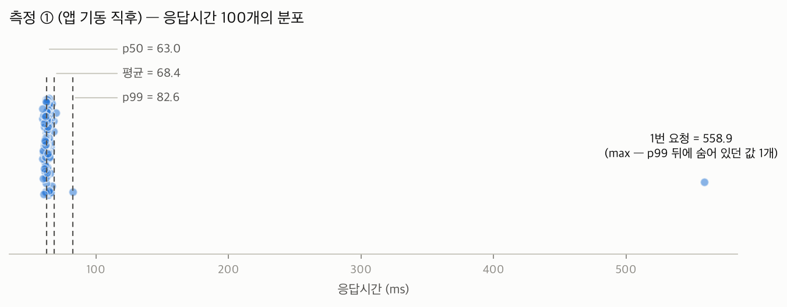
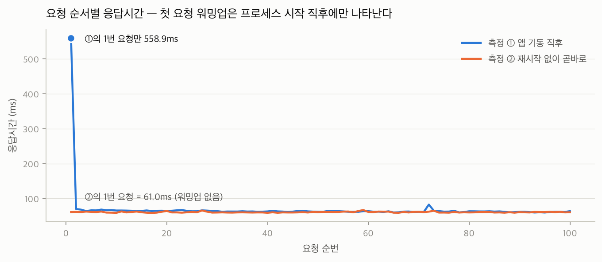

# 성능개선 스터디 1주차, 기본적인 용어와 개념 잡기

## 이번 주 가설
- 목록 API(/api/posts?page=0&size=20)의 p50은 100ms쯤 나올 것이다
- p99는 p50의 20배쯤 될 것이다.

## 목차
1. 왜 이 스터디를 시작했나 (한 문단)
2. 실험 대상: 게시글 100만 건짜리 토이 앱의 목록 API
3. 가설 먼저 쓰기 — p50 100ms, p99는 20배?
4. 측정: curl 100번, 도구 없이 직접 백분위 구하기
5. 결과: 평균 70ms vs p50 64ms — 6ms 차이의 범인은 값 1개
6. p99가 좋아 보여도 max를 봐야 하는 이유 (표본 100개의 함정)
7. 첫 요청은 왜 0.6초였나 — 가설 두 개와 판별 실험
8. 예상과 달랐던 점
9. 다음 주: k6로 baseline 잡기

## 측정 환경 / 방법
- 앱: Spring Boot 3 + Java 21, PostgreSQL 16 (Docker), 게시글 100만 건 / 댓글 200만 건
- 대상: `GET /api/posts?page=0&size=20` (최신순 목록)
- 방법: curl 100회 순차 실행 → 응답시간 원본 저장 → `sort -n`으로 정렬 후 50/95/99번째 값을 직접 집음

```bash
for i in $(seq 1 100); do
  curl -s -o /dev/null -w "%{time_total}\n" "$URL"
done > result.txt

sort -n result.txt | awk 'NR==50||NR==95||NR==99 {print NR": "$0}'
```

## Before / After

측정 ①: 앱을 새로 시작한 직후 100회. 측정 ②: **재시작 없이** 곧바로 100회 더.

| 항목 | ① 기동 직후 | ② 재시작 없이 |
|---|---|---|
| p50 | 63.0ms | 60.4ms |
| p95 | 67.0ms | 62.8ms |
| p99 | 82.6ms | 65.6ms |
| max | **558.9ms** | 66.9ms |
| 평균 | 68.4ms | 60.8ms |
| 1번 요청 | **558.9ms** | 61.0ms |

- ①의 max = 1번 요청. 별도 측정(9/6)에서도 1번 요청만 609.6ms — 재현됨
- 평균(70.1ms) > p50(64.3ms)의 차이는 0.6초짜리 값 **1개**가 만든 것: 그 1개를 빼면 99개 평균 ≈ 64ms = p50



- 실험 전 예측: "서버 워밍업 가설이 맞다면 ②의 1번 요청은 ①의 p50 근처여야 한다" → 적중 (61.0ms ≈ 63.0ms)



## 예상과 달랐던 점
p99가 p50의 20배일 거라고 생각했는데, 생각보다 큰 차이가 안났다. 근데 max는 10배정도 차이가 났음. 사실상 max 값이 나왔던 첫 요청을 빼고 나머지 값들의 크기는 그렇게 크지 않았기 때문에, 오히려 응답 속도를 느리게 하는 요소에 대해서 확실히 알 수 있었다.

---

<!-- 아래는 progress.md에서 가져온 이번 주 기록 (초안 작성용 참고, 발행 전 삭제) -->
## Week 01 — 지표 정의 + 토이앱 탐색 (시작: 2026-08-18)

### 가설
- 목록 API(/api/posts?page=0&size=20)의 p50은 몇 ms쯤 나올 것 같은가? : 100ms
- p99는 p50의 몇 배쯤 될 것 같은가? : 20배

### 측정 방법
- 대상: 목록 API `GET /api/posts?page=0&size=20` (게시글 100만 건, 로컬, 포트 18080)
- 도구: `scripts/measure.sh` — curl을 100회 순차 실행, 응답시간 원본(초)을 저장. 백분위는 `sort -n` 후 50/95/99번째 값을 직접 집음
- 조건: ① 2026-09-06 — 앱 기동 직후 100회. ② 2026-09-26 — 앱 새로 기동 직후 100회(1차) + **재시작 없이** 곧바로 100회(2차). 1차 vs 2차 비교가 워밍업 가설의 판별 실험

### Before

| 측정 | p50 | p95 | p99 | max | 평균 | 1번 요청 |
|---|---|---|---|---|---|---|
| 09-06 (기동 직후) | 64.3ms | 69.9ms | 75.6ms | 609.6ms | 70.1ms | 609.6ms |
| 09-26 1차 (기동 직후) | 63.0ms | 67.0ms | 82.6ms | 558.9ms | 68.4ms | 558.9ms |

- max(≈0.6초)는 두 번 모두 **1번 요청** — 재현됨
- 평균(70.1) > p50(64.3)의 차이는 0.6초짜리 **값 1개**가 만든 것 (그 1개를 빼면 99개 평균 ≈ 64ms = p50과 일치)
- 표본 100개에서 p99 뒤에는 값이 1개뿐 → 0.6초짜리 max는 p99에 안 잡힘

### 바꾼 것
- 코드/설정 변경 없음 (측정 주차). 실험 변수는 **앱 재시작 여부** 하나만: 가설 A(연결 비용)는 curl이 100회 모두 새 연결을 맺는다는 사실로 책상에서 기각, 가설 B(서버 쪽 워밍업)는 "재시작 없이 재측정하면 2차의 1번 요청이 1차 p50 근처여야 한다"로 예측을 먼저 적고 실험

### After

| 측정 | p50 | p95 | p99 | max | 평균 | 1번 요청 |
|---|---|---|---|---|---|---|
| 09-26 2차 (재시작 없이) | 60.4ms | 62.8ms | 65.6ms | 66.9ms | 60.8ms | **61.0ms** |

- 예측 적중: 2차의 1번 요청(61ms) ≈ 1차 p50(63ms). 0.6초급 첫 요청은 **프로세스를 새로 시작했을 때만** 나타남 → 가설 B 지지
- 무엇이 워밍업되는지는 아직 특정하지 않음 — 3~4주차(Actuator, flame graph)에서 확인 예정

### 예상과 달랐던 점
p99가 p50의 20배일 거라고 생각했는데, 생각보다 큰 차이가 안났다. 근데 max는 10배정도 차이가 났음. 사실상 max 값이 나왔던 첫 요청을 빼고 나머지 값들의 크기는 그렇게 크지 않았기 때문에, 오히려 응답 속도를 느리게 하는 요소에 대해서 확실히 알 수 있었다.
