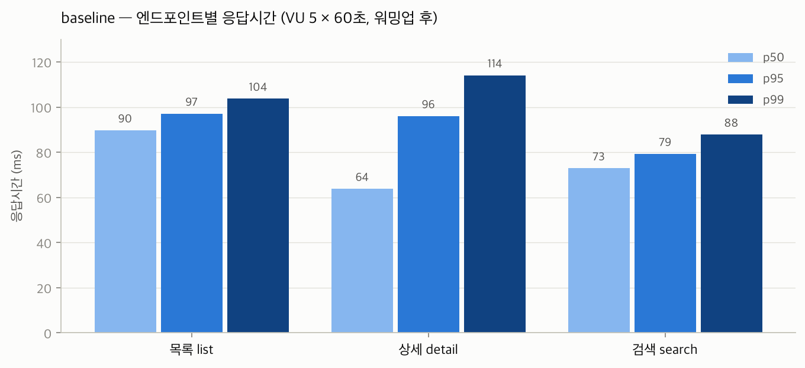

# 성능개선 스터디 2주차 - 서버는 정말 요청을 한 줄로 처리할까?

## 이번 주 가설
- 엔드포인트 3개 중 검색이 제일 느릴 것. 목록과 상세는 index값을 사용하여 빠르게 보여줄 수 있지만, 검색은 DB로 생각해 봤을 때 like 조건인 경우에 내용들을 전부 비교해야 할 수 있기 때문. (단, "목록/상세는 인덱스를 쓴다"는 검증 안 된 가정)
- 제일 느린 놈(검색)의 p95 예상치: 5초
- VU 5 동시 부하에서 목록 API p50은 지난주 순차 측정(63ms)의 2배 정도일 것. (근거 가정: 서버는 요청을 순차 처리한다)

## 목차
1. baseline이 뭐고 왜 필요한가 (개선 전의 기준 측정값)
2. 지난주 측정과 뭐가 다른가 — 순차 1명 vs VU 5명 동시
3. 측정 설계: 워밍업 통제 (지난주 배운 걸 절차에 반영)
4. 결과: 엔드포인트 3개의 baseline 표
5. 가설 ①의 운명 — "검색이 제일 느릴 것(5초)"는 63배 빗나갔다
6. 가설 ②의 운명 — "순차 처리라면 315ms여야 한다" 계산으로 반증
7. 의외의 1등 — 목록은 왜 제일 느린가 (열린 질문으로 남김)
8. 예상과 달랐던 점
9. 다음 주: Actuator로 서버 내부 들여다보기

## 측정 환경 / 방법
- 도구: k6 v2.2.0 — 시나리오 3개(목록/상세/검색)를 각각 VU 5 × 60초, 반복 사이 sleep 0.3s
- 상세는 실트래픽 흉내: 요청의 50%는 인기글(id 1~10000), 50%는 전체 범위 랜덤
- **워밍업 통제**: 앱 새로 기동 → 엔드포인트 3개에 5회씩 예열 요청 → 그 다음 측정
  (1주차에서 확인: 프로세스 시작 직후 첫 요청은 0.6초급 — 통제 안 하면 baseline이 오염된다)
- 총 2,395요청 / 200초 ≈ 초당 12요청, 실패 0 — 서버 입장에선 **저부하(light load)** 기준선

```js
// load/baseline.js 핵심부
const common = { executor: 'constant-vus', vus: 5, duration: '60s' };
export function detail() {
  const hot = Math.random() < 0.5;   // 인기글로 트래픽 쏠림 흉내
  const id = hot ? rand(10000) : rand(1000000);
  http.get(`${BASE}/api/posts/${id}`);
  sleep(0.3);
}
```

## Before / After

baseline 주차라 "바꾼 것"은 없다. 이 표가 이후 15주의 비교 기준이 된다.

| 엔드포인트 | p50 | p95 | p99 | max |
|---|---|---|---|---|
| 목록 list | 89.7ms | 97.1ms | 103.7ms | 251.6ms |
| 상세 detail | 63.8ms | 96.0ms | 114.1ms | 216.7ms |
| 검색 search | 72.9ms | 79.3ms | 87.8ms | 211.6ms |



가설 검증:
- "검색이 제일 느릴 것, p95 5초" → **기각.** 검색 p95 = 79.3ms, 예상 대비 약 63배 과대 추정. 메커니즘 추측("전부 비교해야 할 것")과 비용 추측("그러면 5초")은 별개다
- "서버가 순차 처리한다면 목록 p50은 63ms × 5 = 315ms여야 한다" → 실측 89.7ms. **가정 반증** — 서버는 동시 처리를 한다. "어느 정도까지?"는 다음 열린 질문
- 목록 p50: 지난주 순차 63ms → VU 5에서 89.7ms (예상 2배, 실측 1.4배)

열린 질문 (다음 주차로):
- 목록은 왜 제일 느린가 — "최신순 20개"를 주려면 DB가 뭘 해야 하나? (5~6주차 EXPLAIN)
- 초당 12요청은 저부하였다. VU를 올리면 언제부터 무너지나? (3·11주차)

## 예상과 달랐던 점
예상과 달랐던 점은, 검색의 속도가 p95 기준으로 79.3ms로 가장 빨랐다는 것임. 오히려 빠를 것이라고 생각했던 목록이 97.1ms로 가장 느렸음. 검색의 p95가 5s가 걸릴 것이라고 생각했는데, 실제로는 63배나 크게 생각했던 거였음. 그리고 목록 p50이 89.7ms로 지난주 63ms의 1.4배 정도가 나왔는데, 나는 2배가 걸릴 것이라고 생각했음. 그리고 서버가 요청을 순차적으로 처리할 것이라고 생각했는데, 만약 순차 처리됐다면 p50이 63ms × 5 = 315ms가 나와야 했다. 실제 측정을 해보니 89.7ms가 나왔다는 것은, 순차 처리를 하지 않는다는 것을 알게 되었음.


---

<!-- 아래는 progress.md에서 가져온 이번 주 기록 (초안 작성용 참고, 발행 전 삭제) -->
## Week 02 — k6 baseline (시작: 2026-09-26)

### 가설
- 엔드포인트 3개 중 **검색이 제일 느릴 것**. 목록과 상세는 index값을 사용하여 빠르게 보여줄 수 있지만, 검색은 DB로 생각해 봤을 때 like 조건인 경우에 내용들을 전부 비교해야 할 수 있기 때문. *(주의: "목록/상세는 인덱스를 쓴다"는 검증 안 된 가정 — 5~6주차에 확인)*
- 제일 느린 놈(검색)의 p95 예상치: **5s**
- VU 5 동시 부하에서 목록 API p50은 지난주 순차 측정(63ms)의 **2배 정도**일 것. *(근거 가정: 서버는 요청을 순차 처리한다 — 검증 안 됨)*

### 예상과 달랐던 점 (progress.md 원문)
예상과 달랐던 점은, 검색의 속도가 p95 기준으로 79.3ms로 가장 빨랐다는 것임. 오히려 빠를 것이라고 생각했던 목록이 97.1ms로 가장 느렸음. 검색의 p95가 5s가 걸릴 것이라고 생각했는데, 실제로는 63배나 크게 생각했던 거였음. 그리고 목록 p50이 89.7ms로 지난주 63ms의 1.4배 정도가 나왔는데, 나는 2배가 걸릴 것이라고 생각했음. 그리고 서버가 요청을 순차적으로 처리할 것이라고 생각했는데, 실제 측정을 해보니 89.7ms가 나왔다는 것은, 순차 처리를 하지 않는다는 것을 알게 되었음.
<!-- 교사 피드백: "89.7ms → 순차 아님" 문장은 근거(순차라면 315ms여야 한다는 계산)를 글에 포함해야 논증이 완성됨 -->
